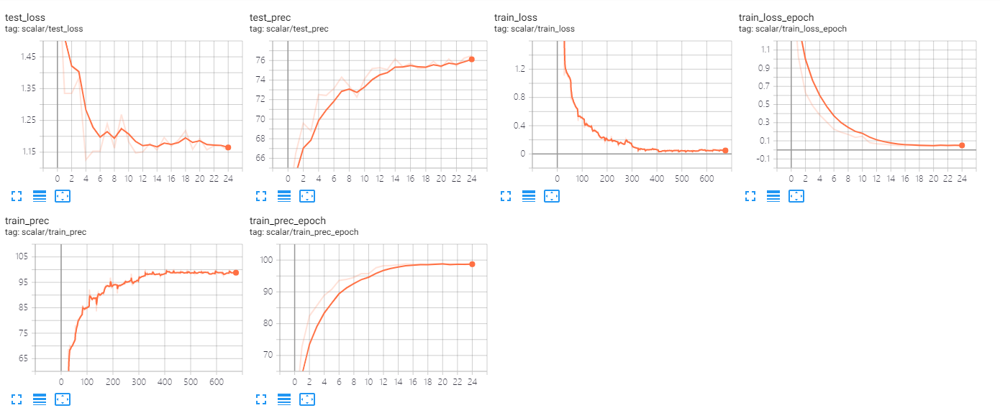
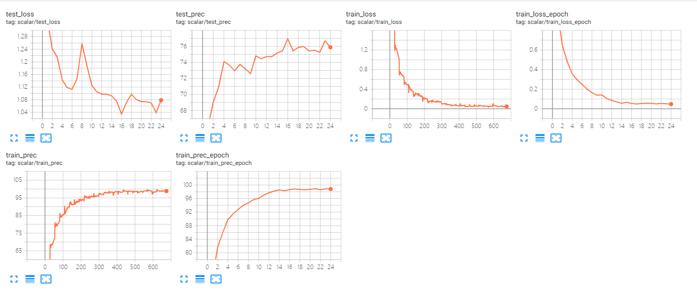
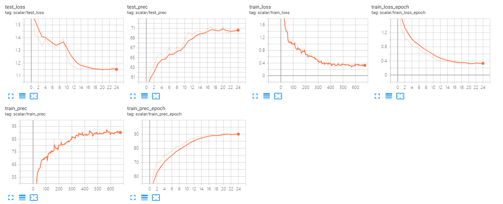
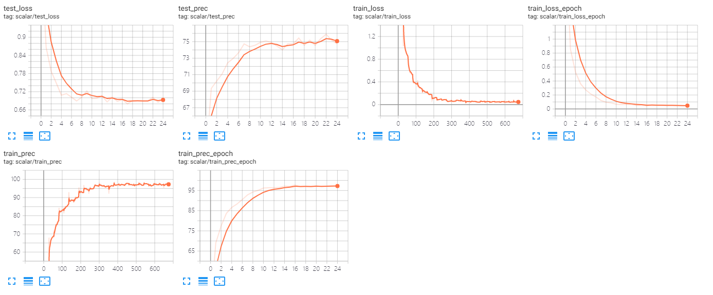
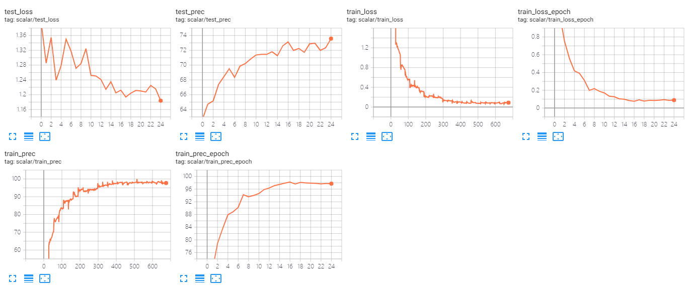
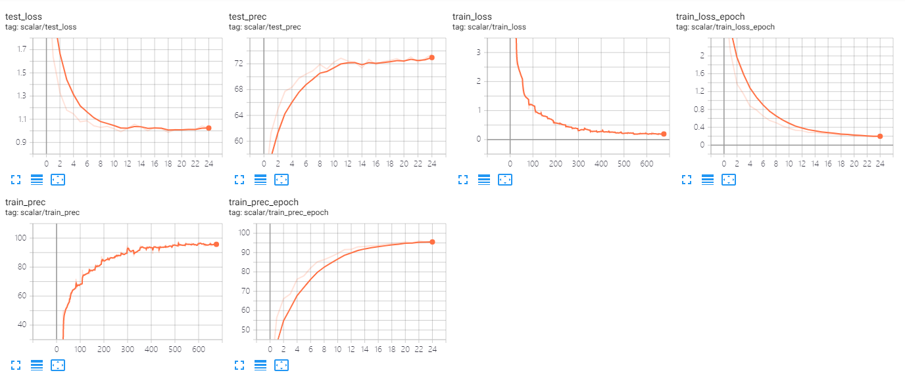
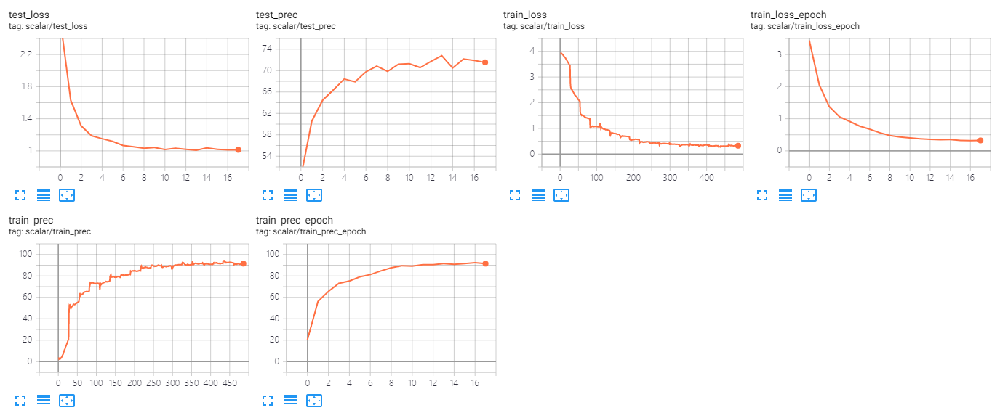

# Exp Logs

## TODO List

- [x] try other net, vgg, inception, resnext, not work
- [x] focal loss, not works
- [x] label smoothing, work
- [ ] attention

## 0112-10-10

**to be the baseline of senet152**

epoch 25

lr 0.05

decay 10 16 22

arch senet152, freeze and free layer4, fc

with bias decay

transforms resize384, crop320, jitter0.4

weight decay 5e-4

**test prec 76.5**




## 0112-11-25

changes compared with 0112-10-10

no bias decay
```python
# no bias decay
param_optimizer = list(filter(lambda p: p.requires_grad, model.parameters()))
no_decay = ['bias', 'LayerNorm.bias', 'LayerNorm.weight']
optimizer_grouped_parameters = [
        {'params': [p for n, p in model.named_parameters() if not any(nd in n for nd in no_decay) and p.requires_grad], 'weight_decay': 0.001},
        {'params': [p for n, p in model.named_parameters() if any(nd in n for nd in no_decay) and p.requires_grad], 'weight_decay': 0.0}
]
optimizer = torch.optim.SGD(optimizer_grouped_parameters,
                            lr=args.lr, momentum=0.9, weight_decay=5e-4)

# original optimizer
# optimizer = torch.optim.SGD(filter(lambda p: p.requires_grad, model.parameters()),
#                             lr=args.lr, momentum=0.9, weight_decay=5e-4)
```

**test prec 76.95**




## vgg with 224

epoch 25

lr 0.05

decay 10 16 22

no bias decay

transforms resize256, crop224, jitter0.4

vgg19bn, freeze and free classifier3,6

**test prec 71.36**




## 0112-17-07

try focal loss based on the baseline in 0112-11-25

changes compare with 0112-11-25

Focal loss with gamma=2 alpha = [1]*num_classes

initial lr=0.05: WARNING:root:NaN or Inf found in input tensor.
initial lr=0.1: WARNING:root:NaN or Inf found in input tensor.
initial lr=0.01


```python
# criterion = nn.CrossEntropyLoss().cuda()
criterion = FocalLoss([1]*args.num_classes, gamma=2, num_classes=args.num_classes).cuda()
```

**test prec 75.89**



## re-implement 11-25

commit id: senet152 with no bias decay
or
commit id: try vgg19bn


## inception

note that the input shape is 299x299

modify train scripts:

```python
if 'inception' in args.arch:
    output, aux = model(inputs)
else:
    output = model(inputs)
```

initial lr=0.05

**test prec 73.58**, seems that lr is too large and free too much parameters.




initial lr=0.01 gamma 0.5

**test prec 73.49**, not fully trained




initial lr=0.01 gamma 0.2

**test prec 72.+**




## senet152 0113-1440

with label smoothing
```python
Loss = LabelSmoothingLoss(args.num_classes, smoothing=0.1)
```